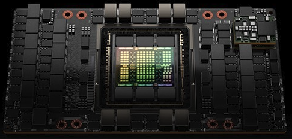
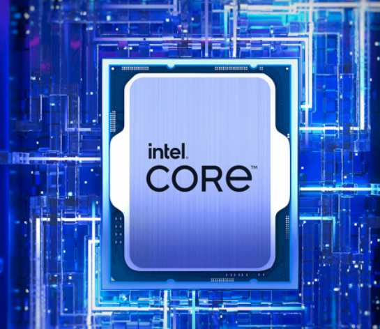

# Chapter 1: CPU vs GPU Architecture and Performance
[Back to Table of Content](../../Readme.md) | **[Next: Efficiency of GPUs over CPUs](02_efficiency.md)**

In this chapter, we discuss the fundamental differences between CPU and GPU architectures, focusing on their performance efficiencies and design philosophies. We highlight how GPUs leverage parallelism through the SIMT model, allowing them to execute numerous threads simultaneously and hide memory latency, making them ideal for *data-parallel programming* tasks

    

        
        
Image Source: Nvidia

    

    

        
        
Image Source: Intel

    

[Back to Table of Content](../../Readme.md) | **[Next: Efficiency of GPUs over CPUs](02_efficiency.md)**
