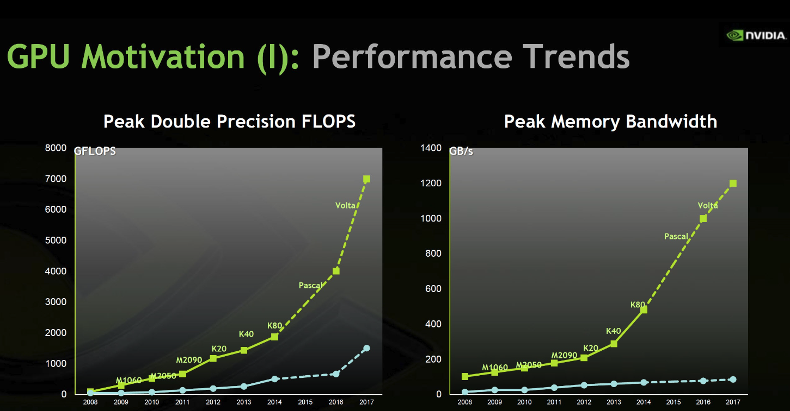

## 1. Efficiency of GPUs over CPUs
[Back to Table of Content](../../Readme.md) | [Previous: Introduction](01_introduction.md) | **[Next: Structural Differences: CPU vs GPU](03_structural_differences.md)**

CPUs and GPUs both use the same transistor technology. However, GPUs are an order of magnitude more efficient in terms of energy per instruction. This efficiency allows GPUs to run significantly more instructions, even with basic air cooling (around 300W dissipation rate). As a result, GPUs have an order of magnitude higher peak performance compared to CPUs.

Image Source: Nvidia

[Back to Table of Content](../../Readme.md) | [Previous: Introduction](01_introduction.md) | **[Next: Structural Differences: CPU vs GPU](03_structural_differences.md)**
