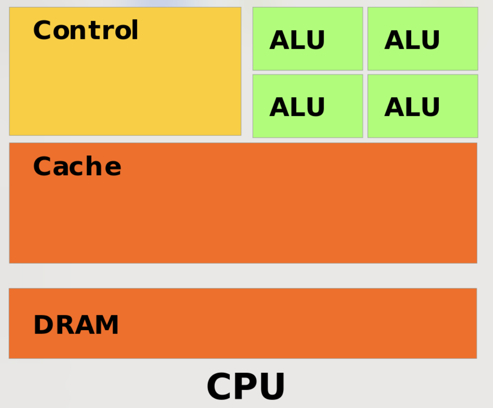
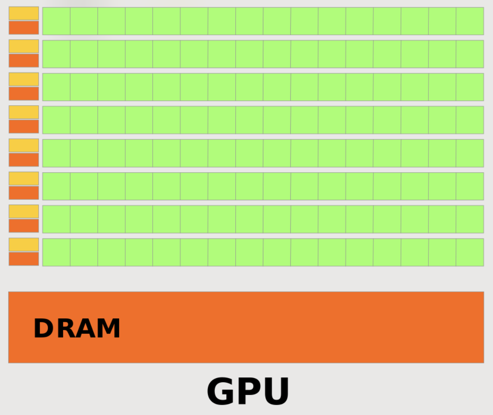

## 2. Structural Differences: CPU vs GPU
[Back to Table of Content](../../Readme.md) | [Previous: Efficiency of GPUs over CPUs](02_efficiency.md) | **[Next: Streaming Multiprocessors (SMs) in GPUs](04_streaming_multiprocessors.md)**

- **CPU**: CPUs have few Arithmetic Logic Units (ALUs), with most of their transistors dedicated to caching (almost half the space). They also have sophisticated control units capable of complex operations such as scoreboarding (reordering instructions based on when their operands are available) and branch prediction.
  
- **GPU**: GPUs, in contrast, have many simple in-order cores (ALUs) and basic control units. This allows GPUs to prioritize parallel execution over complex control logic.

    

        
    

    

        
    

Image Source: Nvidia Programming Guide

[Back to Table of Content](../../Readme.md) | [Previous: Efficiency of GPUs over CPUs](02_efficiency.md) | **[Next: Streaming Multiprocessors (SMs) in GPUs](04_streaming_multiprocessors.md)**
