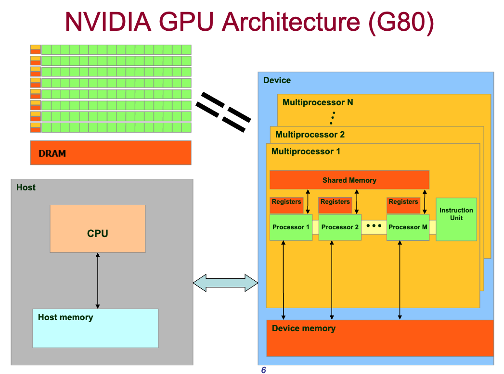

## 3. Streaming Multiprocessors (SMs) in GPUs
[Back to Table of Content](../../Readme.md) |  [Previous: Structural Differences: CPU vs GPU](03_structural_differences.md) | **[Next: SIMT vs SIMD](05_simt_vs_simd.md)**

GPUs typically have fewer than 100 Streaming Multiprocessors (SMs), each with its own scheduler. Each thread block is assigned to only one SM, but an SM may have multiple thread blocks assigned to it. 

Each SM has many registers and a small control unit, scheduling a single instruction for an array of 32 cores (known as SIMT - Single Instruction, Multiple Threads). Each SM also has shared memory (shared among the cores) and private registers dedicated to each core.

[Back to Table of Content](../../Readme.md) | [Previous: Structural Differences: CPU vs GPU](03_structural_differences.md) | **[Next: SIMT vs SIMD](05_simt_vs_simd.md)**