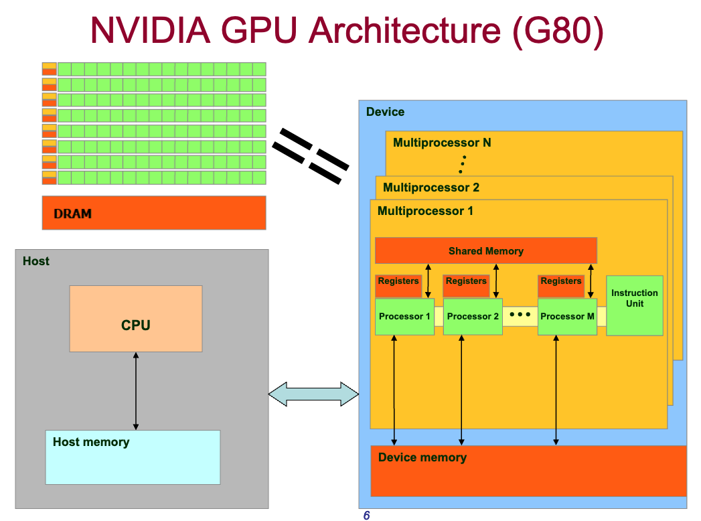

## Streaming Multiprocessors (SMs) in GPUs
[Back to Table of Content](../../Readme.md) |  [Previous: Structural Differences: CPU vs GPU](3.structural_differences.md) | **[Two-Level Parallelism in GPUs](5.two_level_parallelism.md)**

**Streaming Multiprocessors (SMs)** are the fundamental processing units within a GPU that execute multiple threads concurrently. Each SM is capable of managing and executing thousands of threads simultaneously, leveraging its architecture to perform parallel computations efficiently.

**Thread blocks** are groups of threads that are executed together on an SM. Each thread block can contain up to several thousand threads, allowing for shared memory and synchronization among the threads within the block. This organization helps to optimize memory access patterns and enhances parallel execution.

In the figure below, each row in the top right image shows a vector of GPU cores managed by a single SM. SMs are magnified in the right image.

GPUs typically have fewer than 100 SMs, each with its own scheduler. Each thread block is assigned to only one SM, but an SM may have multiple thread blocks assigned to it.

Each SM has many registers and a small control unit, scheduling a single instruction for an array of 32 cores (known as SIMT - Single Instruction, Multiple Threads). Each SM also has shared memory (shared among the cores) and private registers dedicated to each core.

[Back to Table of Content](../../Readme.md) | [Previous: Structural Differences: CPU vs GPU](3.structural_differences.md) | **[Two-Level Parallelism in GPUs](5.two_level_parallelism.md)**
