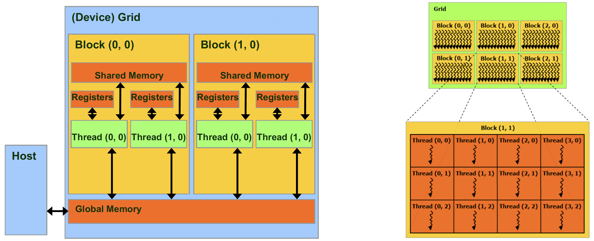

## Thread Hierarchy in GPUs and Data parallel model 
[Back to Table of Content](../../Readme.md) |  [Previous: Streaming Multiprocessors (SMs) in GPUs](4.streaming_multiprocessors.md) | **[Next: Two-Level Parallelism Latency hiding in GPUs](6.two_level_parallelism.md)**

- Threads are organized into a **three-level hierarchy (grid -> thread block -> thread)**:
# Thread Hierarchy:
  - Each kernel creates a single grid consisting of many thread blocks, each containing many threads

- Threads are organized into a hierarchy:
  - **Grid** of **thread blocks** of **threads**
- Threads in the same thread block can cooperate with each other:
  - Share data through **on-chip shared memory**
  - Synchronize using the `__syncthreads` primitive

---
**Multi-dementional IDs:**
- **Threads** and **thread blocks** have **multi-dimensional integer IDs**:
  - **BlockID in grid**: `blockIdx.x`, `blockIdx.y`, `blockIdx.z` (1D/2D/3D)
  - **ThreadID in thread block**: `threadIdx.x`, `threadIdx.y`, `threadIdx.z` (1D/2D/3D)
  - **Thread-block dimensions**: `blockDim.x`, `blockDim.y`, `blockDim.z`
  - **Grid dimensions**: `gridDim.x`, `gridDim.y`, `gridDim.z`

---
**Warp**
- Contiguous threads in a thread block are grouped into groups of 32 threads called a **warp**:
  - Contiguous along `x`, then `y`, then `z`
  - Similar to **linearization** of multi-dimensional arrays we linearize the 3-dimensional ID of threads then each 32 contiguous threads form a warp.
- Each warp executes in **SIMT fashion**:
  - Same instruction in the same clock cycle

---
### Thread Assignment to Streaming Multiprocessors (SMs)

- **Block-level assignment:** Threads are assigned to Streaming Multiprocessors (SMs) in *thread block granularity*. 
  
- **Concurrency limits:**
  - Each SM can handle up to **16 thread blocks concurrently**, depending on available resources like registers and shared memory.
  - An SM can manage up to **64 warps** or **2048 threads** at once (older GPUs only allow 1024 threads or 32 warps).

- **Example configurations:**
  - 256 threads per block × 8 blocks = 2048 threads.
  - 128 threads per block × 16 blocks = 2048 threads.

- **Concurrent execution:** 
  - Threads within these blocks run concurrently.
  - The SM is responsible for maintaining **thread and block IDs** and managing **thread scheduling** and execution to ensure efficient use of resources.

This system allows for flexible and efficient use of the SM's resources, enabling it to handle varying workloads depending on thread and block configurations.

---
# Data Parallel Model: 
- Each output element is processed by a separate thread. Each thread must determine the data element it should compute on

**Example:** In the below figure, we have an array of 1024x1024 elements. Lets say we plan to increament all the elements of this array by 1. To do this we can have the following thread hierarchy: we have a 1D grid of 4096 thread blocks. Each of the 1D thread blocks has 256 threads (so we have 4096x255 threads exactly equal to the number of elements in the array).    

Now lets compute the index of the element that the threadId.x = 3 of blockId.x = 2 is responsible of:
**Element index** = **blockDim.x** X **blockId.x** + **threadId.x** = 256 X 2 + 3 = 515
[Back to Table of Content](../../Readme.md) |  [Previous: Streaming Multiprocessors (SMs) in GPUs](4.streaming_multiprocessors.md) | **[Next: Two-Level Parallelism Latency hiding in GPUs](6.two_level_parallelism.md)**