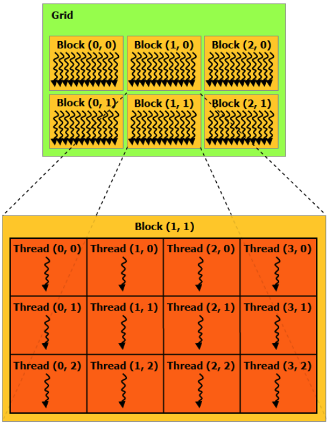
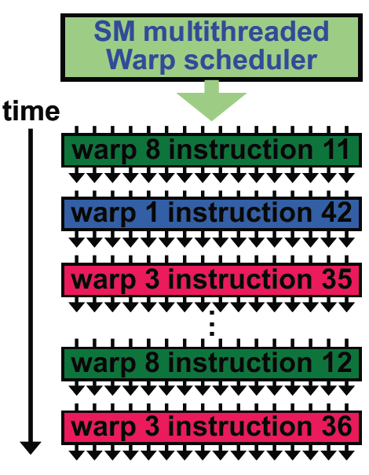
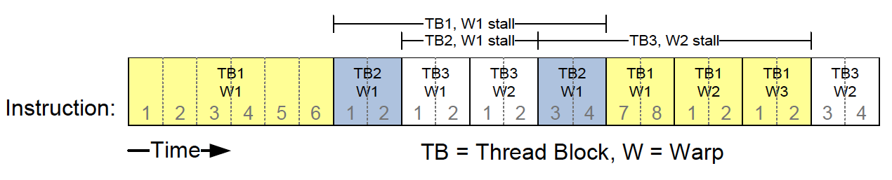

## Two-Level Parallelism Latency hiding in GPUs
[Back to Table of Content](../../Readme.md) | [Previous: hread Hierarchy in GPUs and Data parallel model](5.GPU_Thread_Hierarchy-DataParalellModel.md) | **[Next: Synchronization in GPU Threads](7.synchronization.md)**

## Two-Level Parallelism 
CPUs typically have a single level of parallelism with thread IDs. In contrast, GPUs have **two levels of parallelism**:

1. A grid of thread blocks, where each block is assigned to an SM by the *thread block scheduler*. Thread blocks are allocated to different Streaming Multiprocessors (SMs) according to a scheduling policy. For example, SM0 first loads a thread block \( t_0 \) and, if it has remaining resources[^1], may load another thread block \( t_1 \) until it reaches capacity. SM1 and the other SMs follow the same process. This allocation is managed by the thread block scheduler. Thread-block never suspended to release resources; bound for life of Thread-Block execution.

2. Inside each thread block, there are **warps**, which are groups of 32 threads executing in parallel. Warps serve as the fundamental units of execution, and the SM's *warp scheduler* schedules an entire warp each time. Within each SM, the internal warp scheduler concurrently schedules warps from different thread blocks. When a warp is stalled other warps are scheduled. It cycles through these warps until one thread block completes. When all warps in a thread block are complete, resources are freed by the thread block. At which point it signals the outer thread block scheduler to load another thread block into the SM. 

When threads in CPUs want to do a context switch ( due to some stalls like when waiting for memory operands), they have to release the binded registers; this is done by cloning them into the memory which can take 100s of cycles. In contrast, GPUs bind registers to threads for their life-time, and thanks to that and other GPU harware mechanism, they have `Zero-Cycle thread switching`. 

    

        
        
A grid of thread blocks

    

    

        
        
Thread blocks assignment to SMs

    

Image Source: Nvidia

## Hiding the Latency
- **Here is an example of SM's warp scheduler in action**. It first excutes the warp8 in which threads are running instruction number 11. Instruction number 12 is also asigned to warp 8, however due to some operand which is not ready (say a memory call by instruction 11) the warp get stalled and another warp gets scheduled, but this happens in `zero-cycle` and the scheduler immidiately schedules (warp 1, instruction 42) and then (warp 3, instruction 35). Meanwhile, the oprand needed for (warp 8, instruction 12) is ready and it can now be scheuled.
     

- `Zero-Cycle thread switching` together with huge thread concurrancy in GPUs allows them to **hide the memory latency** ( recall that unlike CPUs number of threads in GPUs is by some orders of magnitude larger than number of physical cores).

### Scoreboarding
**Scoreboarding** is technique used in processors, in this case GPUs, to manage instruction execution by ensuring that all operands are available before an instruction is issued. Each instruction in the buffer is scoreboarded—meaning, its register operands are tracked until the necessary values are deposited. Once the operands are ready, the instruction can be issued, and this prevents hazards such as *data dependencies* that could cause incorrect execution. By "clearing" these hazards through scoreboarding, instructions become eligible for issue without stalling the pipeline unnecessarily.

### Decoupled memory/processor pipelines. 
This technique allows threads to issue instructions independently, continuing as long as the scoreboard permits. Memory and processor operations can proceed concurrently, and this decoupling lets instructions execute in parallel, or in the "shadow" of others, meaning one can overlap with waiting memory operations. This efficient use of processor cycles ensures better utilization of system resources, minimizing idle time and improving performance.

[^1]: High register usage in warps can reduce the number of active warps in an SM, limiting its ability to hide memory latency. On the other hand, using very few registers increases memory access, which may lead to excessive memory calls. Balancing register usage and memory calls is key to maximizing GPU performance, ensuring that the SM can effectively hide memory latency and maintain high occupancy.

**Concrete Example:** The figure below illustrates how scoreboarding and decoupled memory/processor pipelines operate in practice. It shows a sequence of instructions executed by different thread blocks (TB) and warps (W) over time, with each box representing a warp from a thread block. The timeline moves from left to right, showing how execution progresses even when some warps are stalled.
 

In this example, when a warp encounters a stall (marked as "stall"), it cannot issue any new instructions. However, thanks to decoupled pipelines, other warps can continue issuing instructions while the stalled warp waits. For instance, TB1's W1 stalls at instruction 6 due to a memory operation, but TB2’s W1 continues to execute, taking advantage of the decoupled pipeline to keep the execution flowing. Eventually, TB2 W1 stalls at instruction 2, waiting on its own memory operation, so it's added to the memory queue as well.

Meanwhile, execution moves forward with TB3’s W1 and W2 until TB3 W2 also stalls at instruction 2. At this point, the memory operand for TB2 W1 becomes ready, allowing it to resume and complete its remaining instructions (3, 4). Shortly after, TB1 W1’s memory operand is ready as well, allowing it to continue execution to completion. Finally, TB3 W2’s memory operation is resolved, enabling it to finish as well.

This overlapping of operations across different warps maximizes the use of system resources, minimizing idle time and keeping the execution pipeline busy, even when some warps are waiting on memory. This approach improves overall efficiency and performance by reducing bottlenecks caused by stalls.
  

[Back to Table of Content](../../Readme.md) | [Previous: hread Hierarchy in GPUs and Data parallel model](5.GPU_Thread_Hierarchy-DataParalellModel.md) | **[Next: Synchronization in GPU Threads](7.synchronization.md)**
