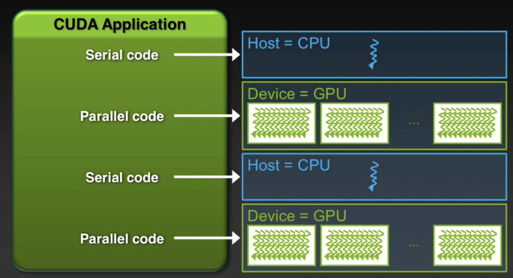

# Chapter 2: CUDA Programming in Practice
[Back to Table of Content](../../Readme.md) | **[Next: ]()**

In this chapter we focus on CUDA programming in practice, we talk about the host-device hetrogenious programming model and go through details of kernel programming and lunchin kernels from host with example code.

Image source: Cliff Woolley, Nvidia

[Back to Table of Content](../../Readme.md) | **[Next: ]()**
