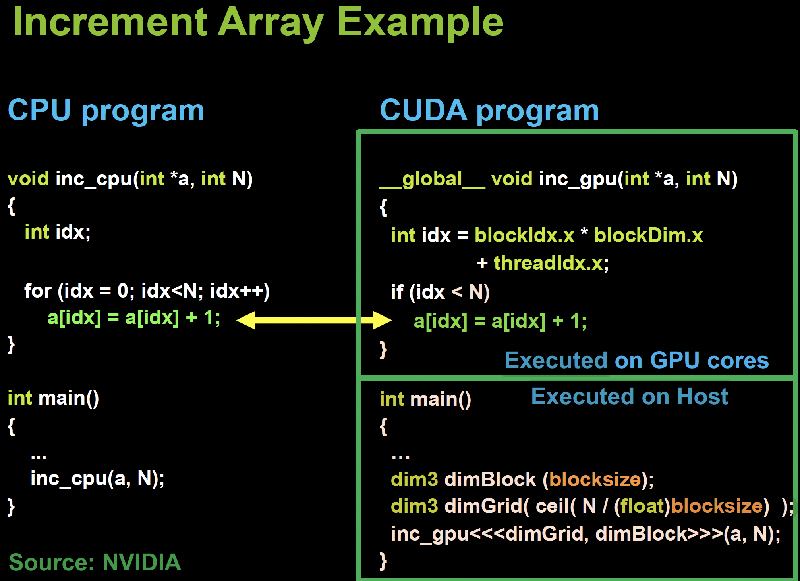
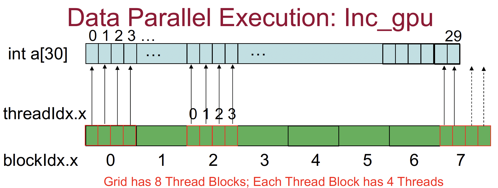

## Increment Array Example
[Back to Table of Content](../../Readme.md) | [Previous: Host-Device Heterogeneous Programming Model](2.Host-Device-Model.md) | **[Next: Necessary Steps for Host-Device Heterogeneous Code](4.steps_Host_Device_Code.md)**

- Example: Each element of array `a[0:N-1]` is incremented by 1.
- On a multicore CPU: use coarse-grained parallelism; #threads = #cores.
- On a GPU: use fine-grained parallelism; one thread per data element!
  - 1D grid and 1D thread-block of size “blocksize” (multiple of 32, within HW limit).
  - Gridsize (number of thread-blocks) is `ceil(N / (float) blocksize)`.
  - If N is not a multiple of blocksize, #threads > N; so each thread must check if it is “active.”



In the figure above we see both CPU code on the left and its equivalent host-device code on the right. 

**Kernel Lunch:**  
Note the kernel launch in the main function: 
```cpp
    dim3 dimBlock(blocksize);
    dim3 dimGrid(ceil(N/(float)blocksize));
    inc_gpu<<<dimGrid, dimBlock>>>(a, N);
```
**Explanation**:
- `dim3 dimBlock(blocksize);`: This defines the number of threads in a single block (`dimBlock`). The value `blocksize` is chosen as a multiple of 32 for efficient execution, as GPUs execute threads in warps of 32.
- `dim3 dimGrid(ceil(N/(float)blocksize));`: This defines the number of blocks in the grid (`dimGrid`). The grid size is calculated by dividing the total number of elements (`N`) by the `blocksize`, and using the `ceil()` function ensures that even if `N` is not a multiple of `blocksize`, all elements are covered.
- `inc_gpu<<<dimGrid, dimBlock>>>(a, N);`: This is the kernel launch, where the GPU begins executing the `inc_gpu` kernel with the specified grid (`dimGrid`) and block (`dimBlock`) dimensions. Each thread will process a single element of the array `a`, incrementing it by 1.
  - <<<dimGrid, dimBlock>>> is the CUDA syntax for launching a kernel with a grid of dimGrid blocks and each block containing dimBlock threads.
  - a is the array to be processed by the kernel. N is the total number of elements in the array a.

**The CUDA Kernel**
Note the kernel inc_gpu code. This kernel function increments each element of the array `a` by 1 in parallel, with each thread handling one element. The global thread index is computed based on the block and thread indices. Threads outside the bounds of the array are skipped using the conditional check. 

```c
__global__ void inc_gpu(int *a, int N) 
{
    int idx = blockIdx.x * blockDim.x + threadIdx.x;

    if (idx < N) 
    {
        a[idx] = a[idx] + 1;
    }
}
```
### Explanation:

- **`__global__`**: This indicates that `inc_gpu` is a kernel function, meaning it will run on the GPU. The function is callable from the host (CPU) but executed on the device (GPU).
  
- **`int *a`**: This is a pointer to an integer array (on the GPU), where the input array `a` will be incremented element by element.
  
- **`int N`**: This represents the total number of elements in the array `a`.

- **`int idx = blockIdx.x * blockDim.x + threadIdx.x;`**: 
  - **`blockIdx.x`**: The unique block ID within the grid.
  - **`blockDim.x`**: The number of threads in each block (block size).
  - **`threadIdx.x`**: The unique thread ID within the block.
  
  This expression calculates the global thread index (`idx`), which determines which element of the array the thread will operate on.

- **`if (idx < N)`**: This ensures that the thread only processes valid indices. If the number of threads exceeds `N` (because the block size is not a perfect divisor of `N`), the extra threads are inactive and do nothing.

- **`a[idx] = a[idx] + 1;`**: Each active thread increments the corresponding element of the array `a` by 1.

**Example**
Lets say we have an array of 30 elements, we can have a thread hierarchy as follows: 8 thread blocks each with 4 threads like the figure below:



**Final code will be like this:**

```c
__global__ void inc_gpu(int *a, int N)
{ 
    int idx = blockIdx.x * blockDim.x + threadIdx.x;
    if (idx < N)
    a[idx] = a[idx] + 1;
}
int main()
{
    int N, blocksize, a[30];
    N=30; blocksize=4;
    dim3 dimBlock (blocksize);
    dim3 dimGrid( ceil( N / (float)blocksize) );
    inc_gpu<<<dimGrid, dimBlock>>>(a, N);
}
```


[Back to Table of Content](../../Readme.md) | [Previous: Host-Device Heterogeneous Programming Model](2.Host-Device-Model.md) | **[Next:Necessary Steps for Host-Device Heterogeneous Code](4.steps_Host_Device_Code.md)**
