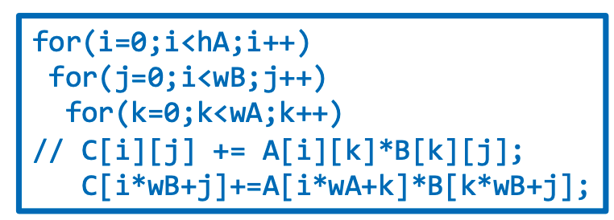
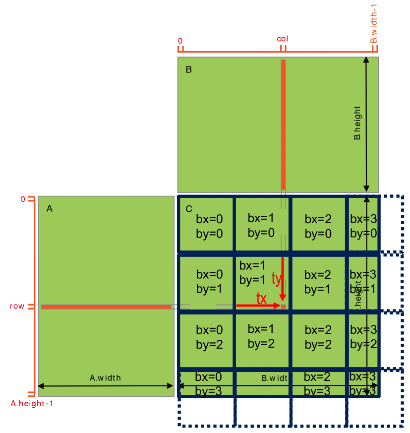

## Matrix Multiplication Example
[Back to Table of Content](../../Readme.md) | [Previous: CUDA Syntax](5.cuda_syntax.md) | **[Next:]()**



We have discussed the GPU increment example extensively before. To reinforce our knowledge, let's work through another well-known example: dense matrix-matrix multiplication. In the classic matrix-matrix multiplication problem, given matrix A with dimensions `m x k` and matrix B with dimensions `k x n`, we want to compute matrix C, which has dimensions `m x n`. Above, you can see the serial matrix multiplication code, where A is `HA x WA`, B is `HB x WB`, and C is `HC x WC`. Note that `HC = HA`, `WB = WC`, and `WA = HB`.

### Host Code

The code below shows the host code for our first version of matrix multiplication in this course. The steps are similar to the general host template we discussed earlier ([Necessary Steps for Host-Device Heterogeneous Code](4.steps_Host_Device_Code.md)).

First, we allocate the matrices on the CPU and randomly initialize A and B (steps 1 and 2). In step 3, we allocate memory on the device for the matrices. The naming convention is that host arrays' pointers start with `h_`, and device arrays' pointers start with `d_`.

A general point worth mentioning is that the device pointers reside in the CPU's memory space, as the GPU does not have an operating system. The CPU manages its memory addresses. In step 4, we copy the matrices A and B from the host to the device via the `cudaMemcpy` API. Step 5 is the most essential step, as we define our work strategy by specifying the thread hierarchy parameters. We will go through this step and explain why we chose these parameters next.

Step 6 is the execution of our matrix multiplication kernel, which computes the results on the device. Note that kernel calls are asynchronous on the host, meaning that the CPU won’t wait for the kernel to complete. Normally, we add `cudaDeviceSynchronize();` right after it. However, there is an implicit call to `cudaDeviceSynchronize();` in the `cudaMemcpy()` under step 7, so we don’t need to explicitly mention it.

In step 7, we copy the results from the device back to the host. Finally, step 8 involves memory management: we clean up both host and device memory.


```c
// 1. allocate host memory
int size_A = WA * HA; 
int mem_size_A = sizeof(float) * size_A;
float* h_A = (float*) malloc(mem_size_A);

int size_B = WB * HB; 
int mem_size_B = sizeof(float) * size_B;
float* h_B = (float*) malloc(mem_size_B);

int size_C = WC * HC; 
int mem_size_C = sizeof(float) * size_C;
float* h_C = (float*) malloc(mem_size_C);

// 2. initialize host memory
randomInit(h_A, size_A); 
randomInit(h_B, size_B);

// 3. allocate device memory
float* d_A; 
cudaMalloc((void**) &d_A, mem_size_A);

float* d_B; 
cudaMalloc((void**) &d_B, mem_size_B);

float* d_C; 
cudaMalloc((void**) &d_C, mem_size_C);

// 4. copy host memory to device
cudaMemcpy(d_A, h_A, mem_size_A, cudaMemcpyHostToDevice);
cudaMemcpy(d_B, h_B, mem_size_B, cudaMemcpyHostToDevice);

// 5. setup execution parameters
dim3 threads(BLOCK_SIZE, BLOCK_SIZE);
dim3 grid(ceil(WC / (float)threads.x), ceil(HC /(float) threads.y));

// 6. execute the kernel
matrixMul<<< grid, threads >>>(d_C, d_A, d_B, HA, WA, WB);

// 7. copy result from device to host
cudaMemcpy(h_C, d_C, mem_size_C, cudaMemcpyDeviceToHost);

// 8. clean up memory
free(h_A); 
free(h_B); 
free(h_C);
cudaFree(d_A); 
cudaFree(d_B); 
cudaFree(d_C);
```

### Thread Hierarchy

- The main idea for the work sharing between threads in this matrix multiplication example is: **"each thread computes a single element of the output matrix."**
- In the figure below, we see matrices A, B, and C in green.
- Blue blocks indicate the thread blocks (some threads in the boundary thread blocks are idle as there is no element for them to process).
- We define `BLOCK_SIZE x BLOCK_SIZE` 2D thread blocks, each responsible for computing a `BLOCK_SIZE x BLOCK_SIZE` block of the C matrix. That’s why in the host code we have `dim3 threads(BLOCK_SIZE, BLOCK_SIZE);`.
- We set up a 2D grid of thread blocks by dividing the dimensions of the C matrix by `BLOCK_SIZE`, like this: `dim3 grid(ceil(WC / (float)threads.x), ceil(HC / (float)threads.y));`. Note that we use the `ceil` function to ensure that all the elements in the result matrix are covered. This may leave some threads in the boundary thread blocks idle if the dimensions of the C matrix are not a perfect multiple of `BLOCK_SIZE`, as shown in the figure below.



### Kernel Code (Device)

- Now that we’ve designed the thread work strategy and thread hierarchy, we can write the kernel code (see code section below).
- Recall that the kernel code is executed by all threads. Each thread first figures out what work it is responsible for. In this example, as discussed, each thread has to compute a single element in the result matrix, so it needs to calculate the indices of that element. This is done in steps 1 and 2 in the kernel code, where the thread computes the row and column of the element (by multiplying the block index by the block dimension and adding the thread index, you get the global row index of the current thread. This index is used to access elements in matrices A and C. Similar for col in step2).
- Step 3 starts with a boundary check to ensure that the index computed by the thread is valid and within bounds. Finally, the thread computes the result element by performing a dot product of the corresponding row of A and the column of B.


```c
__global__ void mmkernel(float* A, float* B, float* C, int hA, int wA, int wB)
{
    // 1. Calculate row index of the elt. in A and C
    int row= blockIdx.y*blockDim.y+threadIdx.y;

    // 2. Calculate the column index for B and C
    int col = blockIdx.x*blockDim.x+threadIdx.x;

    // 3. boundary chech
    if ((row < hA) && (col < wB))
    { 
        float Pvalue = 0;
        // thread computes 1 elt. of block sub-matrix
        for (int k = 0; k < wA; ++k)
        { 
            Pvalue += A[row*wA+k]*B[k*wB+col]; 
        }
        C[row*wB+col] = Pvalue;
    }
}
```
