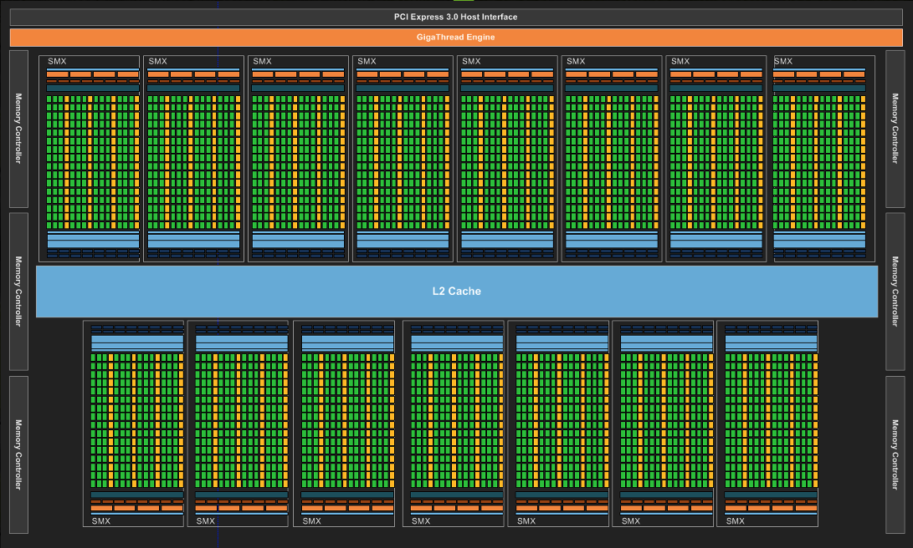

# GPU Memory Hierarchy
[Back to Table of Contents](../../Readme.md) | [Previous: Common Challenges in GPU Programming](2.common-challenges.md) | **[Next: Global Memory Coalescing](4.global-memory-coalescing.md)**

The GPU memory hierarchy is designed to optimize performance by providing different levels of memory with varying capacities, latencies, and bandwidths. Understanding this hierarchy is crucial for efficient GPU programming.

*Image source: NVIDIA*

The image above illustrates the components of a GPU. The green rectangles represent the cores, which are the processing units of the GPU. The orange rectangles indicate various memory elements:

- The memory elements closest to the green rectangles are the registers, which are the fastest memory available to each thread.
- Other orange rectangles represent shared memory, which is used to store frequently accessed data to reduce latency.
- The largest orange rectangle represents global memory, which is off-chip DRAM and is the largest and slowest memory available on the GPU.

## Registers
- **Description:** Registers are the fastest memory available to each thread.
- **Capacity:** Limited to a few KB per thread.
- **Latency:** 1 cycle.
- **Usage:** All operations are performed from registers.

## L1 Cache / Shared Memory
- **Description:** L1 cache and shared memory are used to store frequently accessed data to reduce latency.
- **Capacity:** 48-96 KB per Streaming Multiprocessor (SM).
- **Latency:** Few cycles.
- **Bandwidth:** Extremely High.
- **Usage:** Ideal for data that is reused within a thread block.

## L2 Cache
- **Description:** L2 cache is a larger, slower cache that is shared across all SMs.
- **Capacity:** Few MB.
- **Latency:** 10’s of cycles.
- **Bandwidth:** Moderately High.
- **Usage:** Used to store data that is accessed by multiple SMs.

## Global Memory
- **Description:** Global memory is the largest and slowest memory available on the GPU.
- **Capacity:** 8-64 GB.
- **Latency:** Greater than 100 cycles.
- **Bandwidth:** 100s GB – 1.5 TB/sec.
- **Usage:** Requires high concurrency to overlap the high latency of global memory access. Avoid uncoalesced global memory access to maximize performance.

## Cache Management in GPUs

GPU programming frameworks like CUDA and OpenCL abstract away the details of cache management. Developers typically focus on optimizing shared memory and registers, which are more directly controllable. The GPU hardware and drivers automatically manage the L2 cache, making it less of a concern for developers. The L2 cache is used to improve performance by reducing memory access latency without explicit intervention. Developers often focus on optimizing data locality within the L1 cache and shared memory to minimize latency and maximize throughput. These are more critical for performance tuning in GPU kernels. Directly managing L2 cache would add complexity to the code without significant benefits, as the hardware is already optimized to handle it efficiently.

[Back to Table of Contents](../../Readme.md) | [Previous: Common Challenges in GPU Programming](2.common-challenges.md) | **[Next: Global Memory Coalescing](4.global-memory-coalescing.md)**