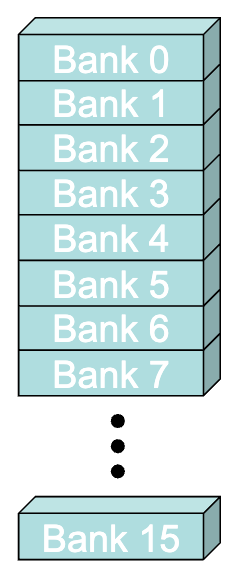
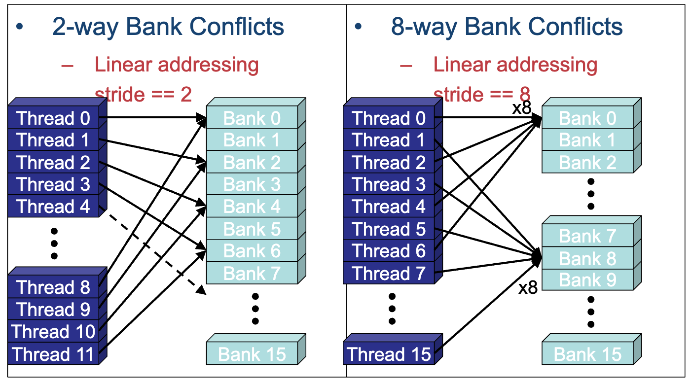
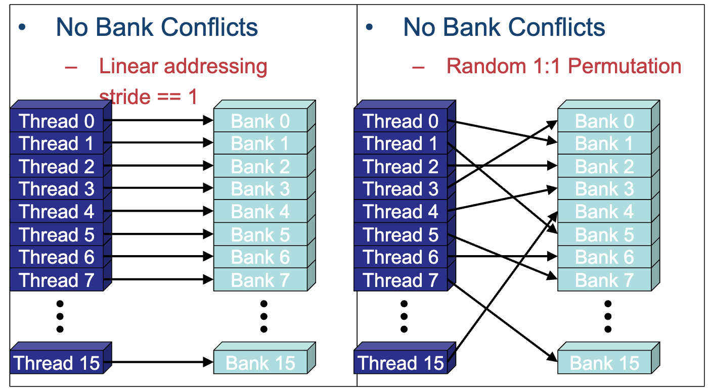
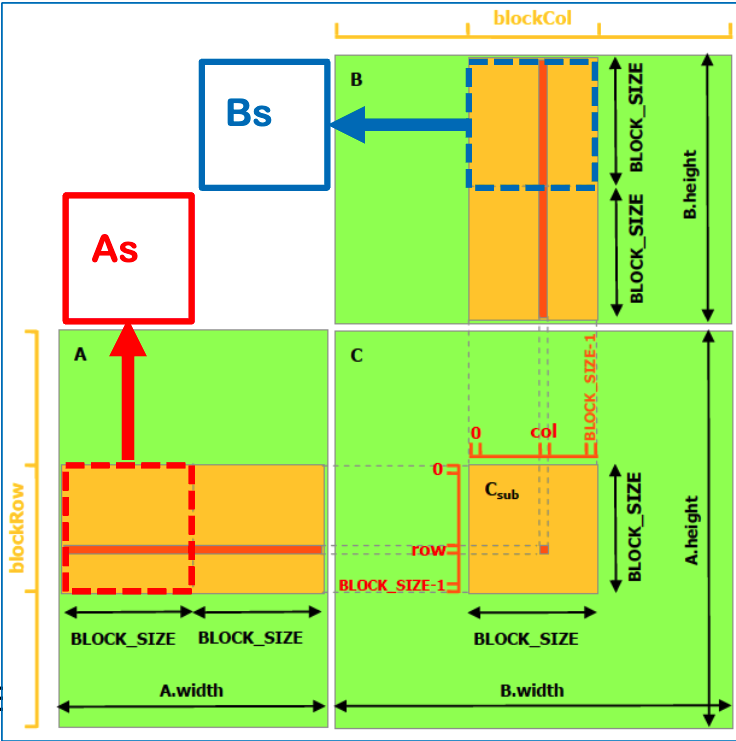

# Shared Memory Programming
[Back to Table of Contents](../../Readme.md) | [Previous: Global Memory Coalescing](4.global-memory-coalescing.md)
### What is shared memory
Shared memory in GPUs is a type of on-chip memory that is shared among the threads of a thread block. It is much faster than global memory because it is located closer to the processing cores. Shared memory allows threads within the same block to cooperate by sharing data, which can significantly improve the performance of parallel algorithms. However, it is limited in size, typically less than 100 KB per block, so it must be used efficiently.

### Structure and Organization of Shared Memory and Bank Conflicts

Shared memory in GPUs is organized by partitioning the total set of storage elements into banks. Each bank can be thought of as an independent memory chip, allowing for parallel access to different banks. This organization helps in reducing access time and increasing efficiency.

#### Bank Organization
- Shared memory is divided into multiple banks.
- Each bank can service one address per cycle.
- Modern GPUs typically have 32 banks, each holding a portion of the total shared memory.
- The address space is mapped to banks in a round-robin fashion, allowing consecutive memory addresses to be distributed across different banks.
- Each bank has a bandwidth of 32 bits per clock cycle.
- Successive 32-bit words are assigned to successive banks.
- G80 had 16 banks; current GPUs have 32 banks.
    - So bank = address % 32.
    - Same as the size of a warp.



Image source: NVIDIA (G80 banks)

#### Bank Conflicts
- **Bank Conflict**: When multiple threads in a warp access the same bank but different addresses, access must be serialized, causing a slowdown.
  - **NOTE:** There is No bank conflicts between different warps, conflicts are only within a single warp.


Image source: NVIDIA

- **No Bank Conflict**: When threads in a warp access different banks, there is no conflict, and maximum bandwidth is achieved.


Image source: NVIDIA

  
- **Special Case**: If all threads access the same address in the same bank, the data can be broadcasted, avoiding conflicts.

#### Access Patterns
- **Stride-1 Access**: Consecutive threads access consecutive memory addresses, mapping to different banks and avoiding conflicts.
- **Higher Stride Access**: If we have larger stides like when the stride is a power of two, it can lead to bank conflicts, causing a slowdown proportional to the stride.

Efficient use of shared memory involves organizing data and access patterns to minimize bank conflicts, thereby maximizing parallelism and performance. We will later talk about how to resolve bank conflicts.


### When is Shared Memory Beneficial?

#### Shared Memory and Resolving Uncoalesced Memory Access to Global Memory

Shared memory is also beneficial for coalescing access to global memory. We have already discussed how to [identify uncoalesced memory accesses](./4.global-memory-coalescing.md), but we have not yet talked about how to resolve them. One approach is to use shared memory to copy the data from global memory in a coalesced manner. Once the data is in shared memory, the kernel code can access it in any order, and the access pattern is not important.

#### Shared Memory and Reuse

Shared memory is extremely useful when `multiple threads within the same block need to use the **same values** their computations (sharing across threads in a threadblock)`. We can mechanically figure this out by checking if data access for 2 different threads are the same or different, if the same then that signals the reuse among the threads and can benefit from shared memory, otherwise, there is no point in wasting the shared memory and we can directly access it from the global memory. Instead of each thread issuing redundant global memory loads, threads can `cooperate` by loading the data once into shared memory, which can be reused by the entire block. This significantly reduces the number of slow global memory accesses. Next we go through an example to demonstrate the usage of shared memory to harness reuse.

However, shared memory is limited in size, typically less than 100 KB. For larger matrices or datasets, a technique called **tiling** is used, where the matrix is divided into smaller blocks or tiles. Each tile is small enough to fit into shared memory and allows efficient reuse of data across threads in a block.

### Example: Optimized matmul CUDA Kernel using Shared Memory

Below is an example of a matrix multiplication kernel optimized using shared memory. The matrix multiplication involves three matrices: `A`, `B`, and `C`. The tile sizes (defined as `BLOCK_SIZE`) determine how much of matrix `A` and matrix `B` can be loaded into shared memory at a time.


#### Tiling and the Overall Structure
In the figure above, a thread block is responsible to compute `BLOCK_SIZE X BLOCK_SIZE` block of the C matrix. Each thread is resposible to compute a single element in the, but we want to do this in a tiled fashion to avoid repeated accesses to global memeory. The yellow shaded bands on A and B are the needed data to compute the yellow block in C matrix. There is a lot of reuse by threads, for instance consider 2 adjacent elements in a row of C matrix, both of these 2 elements need the same row of elements from A matrix, similarly 2 adjacent elements in a column of the C matrix, reuse a single column of B matrix. So somehow we want to avoid repeatitive unnecessary accesses to global matrix, recall that shared memory is benefitial when multiple threads are reusing the same values, and this is a case where it can be benefitial. The strategy is to traverse the yellow bands of A and B over the k dimension in `BLOCK_SIZE X BLOCK_SIZE` tiles and load them into shared memory blocks As and Bs. First, the threads of the threadblock `collectively cooperate` to copy the blocks into the shared memory. Once the data is loaded into the shared memory, each thread computes the element it is responsible, but it access the memories from the shared memory instead which avoids repeatitive access to global memory.  

```cpp
__global__ void
matrixMul( float* A, float* B, float* C, int hA, int wA, int wB)
{ 
    int bx = blockIdx.x; 
    int by = blockIdx.y;
    int tx = threadIdx.x; 
    int ty = threadIdx.y;

    // Starting index of A and B for the thread block
    int aBegin = wA * BLOCK_SIZE * by;
    int bBegin = BLOCK_SIZE * bx;

    float Csub = 0;

    // Declaration of shared memory buffers
    __shared__ float As[BLOCK_SIZE][BLOCK_SIZE];
    __shared__ float Bs[BLOCK_SIZE][BLOCK_SIZE];

    // Starting index of A and B for the thread
    int aInd = aBegin + wA * ty + tx;
    int bInd = bBegin + wB * ty + tx;

    for (int kt = 0; kt < wA; kt += BLOCK_SIZE) {
        As[ty][tx] = A[aInd]; 
        Bs[ty][tx] = B[bInd];
        
        __syncthreads();

        for (int k = 0; k < BLOCK_SIZE; ++k) 
            Csub += As[ty][k] * Bs[k][tx];
        
        __syncthreads();

        aInd += BLOCK_SIZE; 
        bInd += BLOCK_SIZE * wB;
    }

    // Copy back the result computed (from thread local memory) to GPU DRAM
    int c = wB * BLOCK_SIZE * by + BLOCK_SIZE * bx;
    C[c + wB * ty + tx] = Csub;
}
```
#### Code Explaination

### Parameters:
- **float* A**: Pointer to the first input matrix (A).
- **float* B**: Pointer to the second input matrix (B).
- **float* C**: Pointer to the output matrix (C).
- **int hA**: Height of matrix A (number of rows).
- **int wA**: Width of matrix A (and height of matrix B).
- **int wB**: Width of matrix B (number of columns).

The function multiplies two matrices `A` (size: `hA × wA`) and `B` (size: `wA × wB`) and stores the result in matrix `C` (size: `hA × wB`).


### Shared Memory Buffers:
- **As[BLOCK_SIZE][BLOCK_SIZE]**: Shared memory buffer for a tile (sub-block) of matrix A.
- **Bs[BLOCK_SIZE][BLOCK_SIZE]**: Shared memory buffer for a tile (sub-block) of matrix B.


### Main Steps of the Kernel:

1. **Thread Block Starting Indices**:
   - `aBegin`: Starting index of matrix A’s tile (block) for the current thread block. Each block works on a submatrix of A.
   - `bBegin`: Starting index of matrix B’s tile for the current block.

2. **Tile-Loading Loop**:
   - The kernel loads tiles of matrix `A` and matrix `B` into shared memory buffers (`As` and `Bs`).
   - This process is done cooperatively by **all threads in the thread block**, where each thread is responsible for loading a specific element from matrices `A` and `B` into shared memory. 
   - The tiles are loaded in chunks of `BLOCK_SIZE × BLOCK_SIZE`. The loop over `kt` handles stepping through the matrix in these chunks, loading the next set of tiles from `A` and `B` into shared memory.
   - The index calculations, `aInd` for matrix `A` and `bInd` for matrix `B`, determine which specific elements of the matrices each thread should load into shared memory, ensuring each thread block handles its assigned portion of the matrices in a distributed and parallel fashion.

   
3. **Matrix Multiplication**:
   - After loading a tile from matrices `A` and `B` into shared memory, the threads synchronize using `__syncthreads()` to ensure all threads have completed loading the data.
   - Each thread computes a partial sum (`Csub`) by performing the dot product of the corresponding row in the tile of matrix `A` (`As[ty][k]`) and the corresponding column in the tile of matrix `B` (`Bs[k][tx]`).
   - The inner loop over `k` computes this sum across the elements of the tiles.
   - A second call to `__syncthreads()` is critical after the computation of `Csub` to ensure that all threads complete their calculations before proceeding. If this synchronization point did not exist, elements from the next tiles could start being copied to shared memory while some threads were still finishing their computations. This could lead to incorrect results, as data from the subsequent tiles might be written back to global memory before the previous calculations were completed, resulting in race conditions and invalid outputs.
 
4. **Storing the Result**:
   - After all the tiles have been processed (i.e., the loop over `kt` is finished), each thread stores the final result (`Csub`) back into the appropriate position in matrix C.
   - The index `c` determines the global memory location in matrix C where the result for this block will be written.


Relevant Link: [Nvidia example on how to use shared memory + asyncronous memory copy from global to shared](https://docs.nvidia.com/cuda/cuda-c-best-practices-guide/index.html#shared-memory-in-matrix-multiplication-c-ab)
[Back to Table of Contents](../../Readme.md) | [Previous: Global Memory Coalescing](4.global-memory-coalescing.md)
