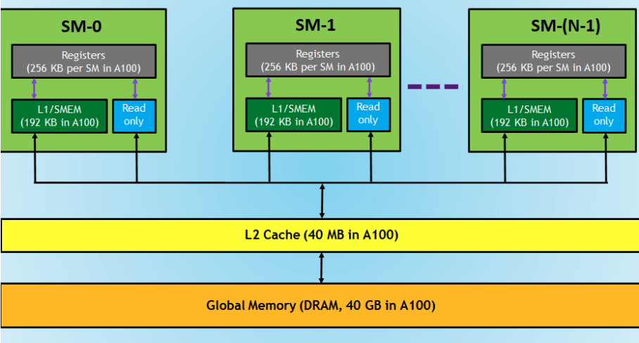

# Chapter 3: GPU Memory Hierarchy and Optimization
[Back to Table of Contents](../../Readme.md) | **[Next: Common Challenges in GPU programming](2.common-challenges.md)**

Image credit: NVIDIA

In this chapter, we explore more advanced topics related to GPU programming and optimization. We begin by discussing **common challenges** encountered when writing efficient GPU code. Next, we delve into the **GPU memory hierarchy**, explaining the different memory levels, including global, shared, and local memory. 

We then examine the issue of **uncoalesced memory accesses** to the GPU’s global memory and present techniques for **memory coalescing** to improve performance. The **shared memory bank conflict issue** is addressed, with strategies provided to avoid these conflicts. 

We also explore **thread divergence**, analyzing how divergence within warps can affect performance, and provide methods to minimize its impact. Finally, we briefly discuss **GPU occupancy** and introduce techniques to improve it.

[Back to Table of Contents](../../Readme.md) | **[Next: Common Challenges in GPU programming](2.common-challenges.md)**
